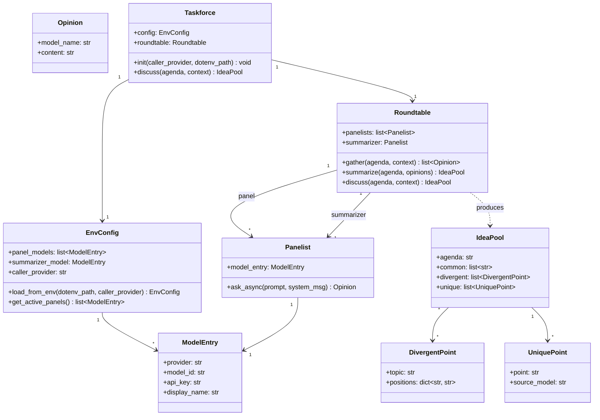
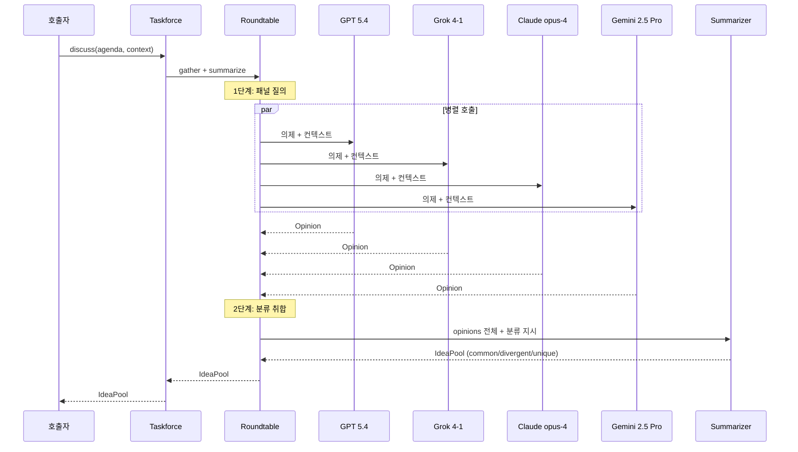

# Taskforce - Architecture

다수의 LLM 패널에 의제를 질의하고 구조화된 아이디어 풀을
반환하는 Python 패키지.

서로 다른 방식으로 발달한 모델들의 관점 다양성을 활용하여
robust한 아이디어 풀을 구축하는 것이 목적.
프로그래머틱하게 import하여 작업흐름에 통합하는 용도.

## 시스템 개요

```mermaid
graph LR
    CALLER[호출자]
    RT[Roundtable]
    PANEL[Panelist Pool]
    SUM[Summarizer]

    GPT[GPT 5.4]
    GROK[Grok 4-1]
    CLAUDE[Claude opus-4]
    GEMINI[Gemini 2.5 Pro]

    CALLER -->|roundtable.discuss(agenda)| RT
    RT -->|병렬 질의| PANEL
    PANEL --> GPT
    PANEL --> GROK
    PANEL --> CLAUDE
    PANEL --> GEMINI
    PANEL -->|raw opinions| RT
    RT -->|분류 취합 요청| SUM
    SUM -->|IdeaPool| RT
    RT -->|IdeaPool| CALLER
```

## Ln 구조

```
src/taskforce/
    for-agent-layerinfo.md
    __init__.py                      # Taskforce 노출

    l1/
        for-agent-layerinfo-l1.md
        schema/
            schema.py                # ModelEntry, Opinion, IdeaPool (pydantic)
            for-agent-moduleinfo.md
            __init__.py

    l2/
        for-agent-layerinfo-l2.md
        config/
            config.py                # EnvConfig: .env 로드, 모델 레지스트리
            for-agent-moduleinfo.md
            __init__.py
        panelist/
            panelist.py              # LiteLLM 래퍼, 개별 모델 호출
            for-agent-moduleinfo.md
            __init__.py
        session_logger/
            session_logger.py        # 세션 전문 로그 (~/.taskforce/logs/)
            for-agent-moduleinfo.md
            __init__.py
        cost_logger/
            cost_logger.py           # 비용 요약 로그 (~/.taskforce/cost_logs/)
            for-agent-moduleinfo.md
            __init__.py

    l3/
        for-agent-layerinfo-l3.md
        roundtable/
            roundtable.py            # 병렬 질의 + summarizer 분류 취합
            for-agent-moduleinfo.md
            __init__.py

    l4/
        for-agent-layerinfo-l4.md
        taskforce_facade/
            taskforce_facade.py      # 최상위 퍼사드
            for-agent-moduleinfo.md
            __init__.py

    mcp_wrapper/
        mcp_wrapper.py               # optional MCP 서버 래퍼
        __init__.py
        __main__.py

tests/
    l1/schema/test_schema.py
    l2/config/test_config.py
    l2/panelist/test_panelist.py
    l2/session_logger/test_session_logger.py
    l2/cost_logger/test_cost_logger.py
    l3/roundtable/test_roundtable.py
    l4/taskforce_facade/test_taskforce_facade.py
```

### 의존성 흐름

```
l1 (schema)        -- pydantic (외부)
l2 (config)           -- dotenv (외부) + l1
l2 (panelist)         -- litellm (외부) + l1
l2 (session_logger)   -- l1
l2 (cost_logger)      -- l1
l3 (roundtable)       -- l2 (panelist) + l1
l4 (taskforce)        -- l2 (config, session_logger, cost_logger) + l3 (roundtable)
```

## 클래스 다이어그램



## 프로세스 시퀀스



## IdeaPool 출력 구조

```
IdeaPool
  +-- agenda: 원본 의제
  +-- common[]: 다수 모델이 동의하는 포인트
  +-- divergent[]: 모델 간 입장이 다른 지점
  |     +-- topic: 쟁점
  |     +-- positions: {model_name: 해당 입장}
  +-- unique[]: 한 모델만 제시한 고유 관점
        +-- point
        +-- source_model
```

## 핵심 설계 결정

### 1. 2단계 파이프라인
- 1단계: 고성능 패널 모델들에 병렬 질의 (관점 수집)
- 2단계: 경량 모델이 raw opinions를 분류 취합 (토큰 압축)
- 메인 에이전트에는 구조화된 IdeaPool만 전달

### 2. Summarizer 모델
- 분류 취합은 grok-4-1-fast-non-reasoning 사용
- XAI_API_KEY를 패널(grok-4-1)과 공유
- EnvConfig에서 summarizer_model로 별도 관리

### 3. Python 패키지 (코어) + MCP wrapper (optional)
- 코어: import하여 프로그래머틱하게 호출
- MCP wrapper: Taskforce를 FastMCP 도구로 노출하는 thin wrapper
- `python -m taskforce.mcp_wrapper` 로 MCP 서버 실행 가능
- 입출력은 pydantic 모델 (JSON 직렬화 가능)

### 4. 비동기 병렬 호출
- 패널 질의는 `asyncio.gather()`로 병렬 실행
- 개별 모델 타임아웃/실패 시 해당 모델만 제외

### 5. 모델 레지스트리

**패널 (고성능)**

| 환경변수 | 프로바이더 | 모델 |
|----------|-----------|------|
| OPENAI_API_KEY | openai | gpt-5.4 |
| XAI_API_KEY | xai | grok-4-1 |
| ANTHROPIC_API_KEY | anthropic | claude-opus-4 |
| GEMINI_API_KEY | gemini | gemini-2.5-pro |

**Summarizer**

| 프로바이더 | 모델 | 비고 |
|-----------|------|------|
| xai | grok-4-1-fast-non-reasoning | XAI_API_KEY 공유 |

### 6. caller_provider 기반 패널 제외
- 초기화 시 `caller_provider`를 받아 해당 프로바이더의 모델을 패널에서 제외
- 메인 에이전트와 동일 모델에 질의하는 것은 관점 다양성에 기여하지 않음
- 예: caller_provider="anthropic" -> claude-opus-4 패널에서 제외
- 키가 설정되어 있고 caller_provider와 다른 모델만 패널에 등록

## 의존성

- `litellm` : 멀티 프로바이더 LLM 호출 통합
- `python-dotenv` : .env 파일 로드
- `pydantic` : 스키마 검증 + JSON 직렬화
- `asyncio` : 병렬 호출 (표준 라이브러리)
- `mcp` : MCP 서버 프레임워크 (optional, MCP wrapper용)
